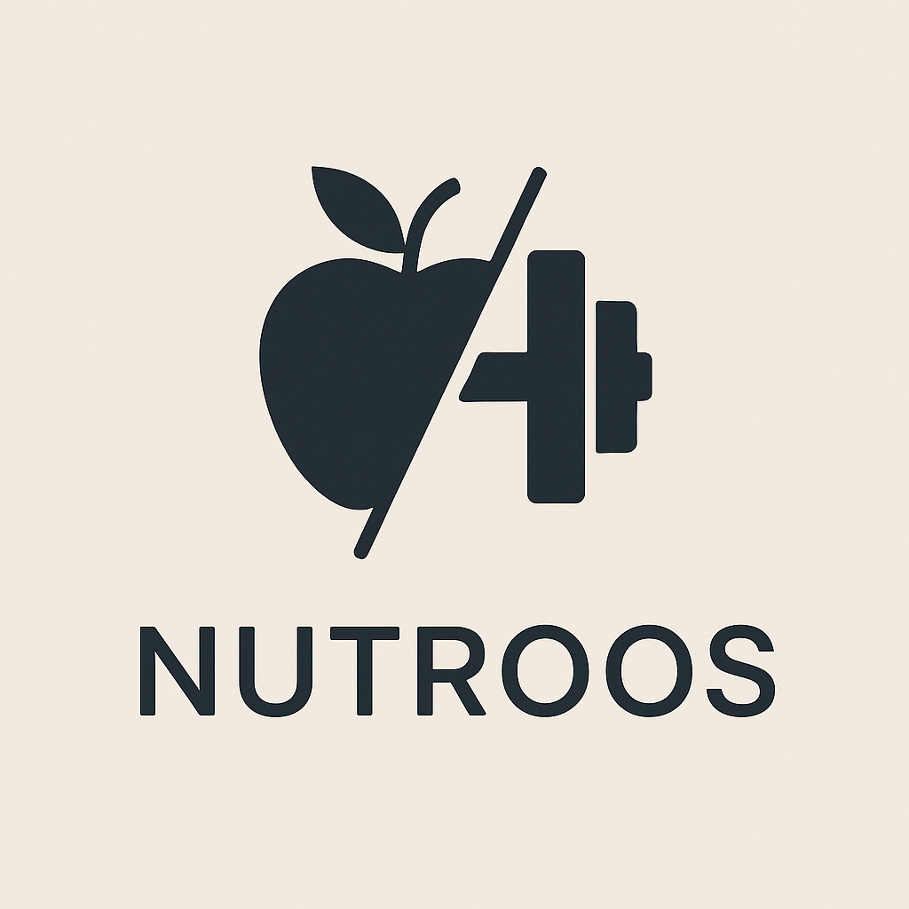

<p align="center">
  
</p>

<h1 align="center">Nutroos</h1>
<p align="center"><em>Aplicación de Nutrición y Entrenamiento Personal</em></p>

---

## 🧠 ¿Qué es Nutroos?

**Nutroos** es una aplicación desarrollada con el **MERN Stack** (MongoDB, Express, React, Node.js) y **TypeScript**. Está pensada para que nutricionistas y entrenadores personales lleven un control personalizado de sus pacientes, ayudándolos a mejorar su salud y alcanzar sus metas.

---

## ✅ Requisitos Previos

Antes de comenzar, asegúrate de tener instalado en tu máquina:

- [Node.js](https://nodejs.org/)
- [npm](https://www.npmjs.com/)
- [MongoDB](https://www.mongodb.com/)

---

## ⚙️ Instalación del Backend

1. **Clona el repositorio:**

   ```bash
   git clone https://github.com/JesusFern/TFG-2025.git
   

2. **Copia el archivo de entorno:**

   ```bash
   cd /backend
   cp .env.local.example .env

3. **Instala las dependencias:**

   ```bash
   npm install

4. **Ejecutar el proyecto:**

   ```bash
   cd /backend
   npm run dev
   cd /frontend
   npm run dev

## 👨‍💻 Autores

Desarrollado por:

- [Jesús Fernández Rodríguez](https://github.com/JesusFern)  
- [Miguel González Ortiz](https://github.com/miggonort1)
